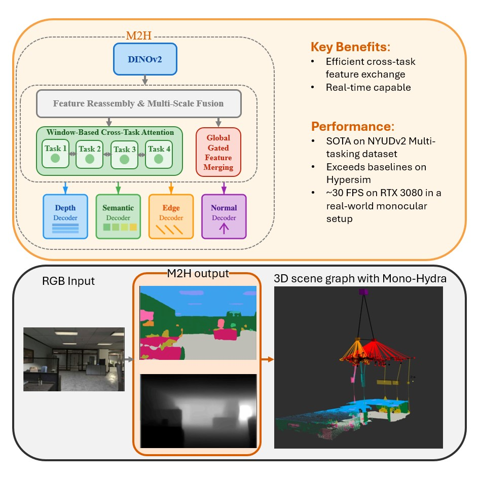
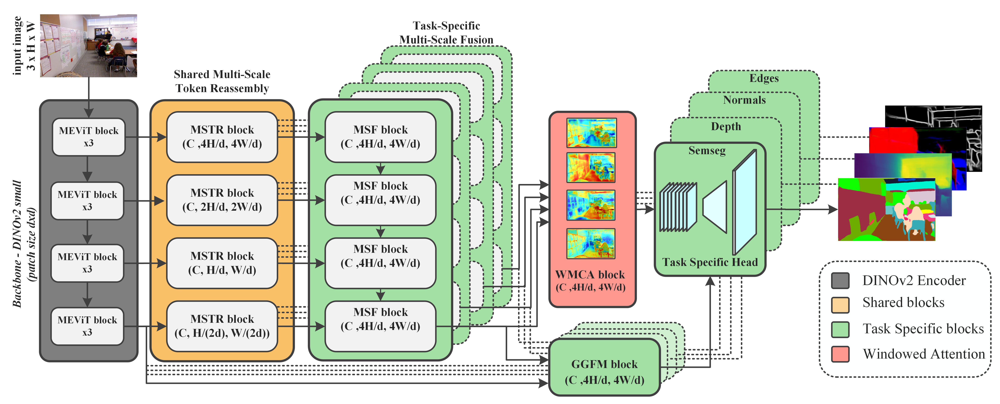
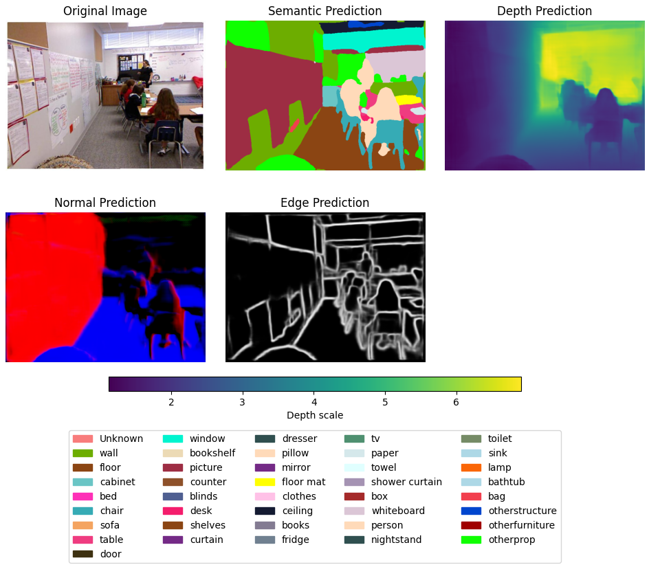

# Multi-Mono-Hydra (M2H)

**[Multi-Task Learning with Efficient Window-Based Cross-Task Attention for Monocular Spatial Perception](https://arxiv.org/pdf/2510.17363)**  

**Authors:** U.V.B.L. Udugama, George Vosselman, and Francesco Nex

This repository hosts the ROS integration of **M2H**, a unified perception framework that performs monocular spatial understanding through joint prediction of semantic segmentation, depth, surface normals, and edge maps from a single RGB image. M2H combines an efficient transformer-based architecture with multi-task learning to improve geometric and semantic reasoning while maintaining real-time performance.



## Features
- RGB-only inference for dense depth and semantic segmentation.
- Configurable output topics and inference cadence.
- Launch files for quick integration with existing camera drivers.
- Window-based cross-task attention and gated feature merging for efficient multi-task feature sharing.

## Main Contributions
- **Unified multi-task framework** that jointly predicts semantics, depth, edges, and surface normals from one monocular image.
- **Window-Based Cross-Task Attention (WMCA)** exchanges information between tasks within localized windows to capture inter-task dependencies without heavy computation.
- **Global Gated Feature Merging (GGFM)** injects global context via a gating strategy, improving scene consistency across tasks.
- **Cross-task consistency learning** (depth–normal and edge–semantic losses) encourages geometric and semantic alignment.
- **Performance and efficiency:** achieves ≈30 FPS on an RTX 3080 while delivering state-of-the-art results on NYUDv2, Hypersim, and Cityscapes.

## Highlights
## Architecture


The M2H architecture is built around a shared Vision Transformer (ViT) encoder based on DINOv2, followed by a set of lightweight, task-specific decoders for semantic segmentation, depth, surface normals, and edges. A Window-Based Cross-Task Attention (WMCA) module enables efficient feature interaction across tasks within localized spatial windows, while the Global Gated Feature Merging (GGFM) block integrates global context through channel-wise gating. Together, these components allow M2H to learn both local geometric cues and global semantic relationships in a unified manner. The model efficiently balances shared representation learning and task specialization, resulting in robust and coherent multi-modal scene understanding from a single RGB input.

- Builds on the DINOv2 ViT encoder as a shared backbone for all tasks.
- Employs multi-scale token reassembly to recover spatial structure from transformer features.
- Uses Dynamic Weight Averaging (DWA) to balance multi-task training adaptively.
- Demonstrates consistent improvements over both single-task and prior multi-task baselines.

## Results Summary


**NYUDv2 (validation) — multi-task comparison**

| Method | Semseg mIoU ↑ | Depth RMSE ↓ | Normals mean ↓ | Boundary odsF ↑ |
| --- | --- | --- | --- | --- |
| MTMamba++ [11] | 57.01 | 0.4818 | 18.27 | 79.40 |
| SwinMTL [12] | 58.14 | 0.5179 | — | — |
| M2H-small (ours) | 58.05 | 0.4396 | 14.04 | 74.44 |
| **M2H (ours)** | **61.54** | **0.4196** | **13.81** | **85.27** |

**Parameters & GFLOPs (NYUDv2)**

| Method | #Params | GFLOPs |
| --- | --- | --- |
| TaskPrompter [29] | 373 M | 416 |
| SwinMTL [12] | 87.38 M | 65 |
| MTMamba++ [11] | 315 M | 524 |
| M2H-small (ours) | 33.7 M | 59 |
| **M2H (ours)** | **81 M** | **488** |

**3D Mapping Test (ITC dataset) with Mono-Hydra framework**

| Model | 2nd Floor ME (m) ↓ | 2nd Floor SD (m) ↓ | 3rd Floor ME (m) ↓ | 3rd Floor SD (m) ↓ | FPS ↑ |
| --- | --- | --- | --- | --- | --- |
| DistDepth[36]+HRNet[37] | 0.19 | 0.18 | 0.21 | 0.16 | 15 |
| MTMamba++ [11] | 0.21 | 0.22 | 0.18 | 0.19 | 18 |
| M2H-small (ours) | 0.16 | 0.18 | 0.15 | 0.17 | 42 |
| **M2H (ours)** | **0.11** | **0.14** | **0.10** | **0.13** | **30** |


_Results reproduced from Tables IV–VI in the paper._

M2H produces accurate and temporally stable predictions suitable for real-time robotic perception and mapping pipelines.

## Features
- RGB-only inference for dense depth and semantic segmentation.
- Configurable output topics and inference cadence.
- Launch files for quick integration with existing camera drivers.

## Requirements
- ROS Noetic (or later) with a configured catkin workspace.
- Python 3.8+ with `torch`, `torchvision`, and `mmcv`.
- CUDA-capable GPU recommended; CPU mode supported with reduced throughput.

## Setup
1. Install Git LFS (once per machine) and enable it for your Git environment:
   ```bash
   sudo apt install git-lfs   # or brew install git-lfs on macOS
   git lfs install
   ```
2. Clone this repository into your catkin workspace `src/` directory.
3. Pull the large checkpoints tracked via Git LFS:
   ```bash
   git lfs pull
   ```
   This downloads the pretrained weights to `src/m2h/scripts/checkpoints/` (e.g., `m2h_indoor.pt` for the default model and `m2h_nyudv2.pt` for the lightweight variant).
4. Install Python dependencies (recommended virtualenv):
   ```bash
   python3 -m venv .venv
   source .venv/bin/activate
   pip install -r src/m2h/requirements.txt
   ```
5. Build the workspace:
   ```bash
   catkin build
   source devel/setup.bash
   ```

## Quickstart
```
roslaunch m2h m2h.launch image_topic:=/camera/image_raw
```

The node subscribes to the RGB stream and publishes semantically-colored segmentation maps and depth images. Remap the topics in the launch file or via command-line arguments to match your setup.

Use `model_variant:=lightweight` to run the smaller M2H head when GPU budget is limited.

## Sample Data
A zipped ROS bag covering the 2nd-floor loop of the old ITC building can be downloaded from
[this SURFdrive link](https://surfdrive.surf.nl/s/baJM4fj3DaWwg3T). Download and unzip the archive to obtain the bag file, then replay it with your preferred launch configuration to verify the pipeline end-to-end.

## Parameters
| Name | Default | Description |
| --- | --- | --- |
| `image_topic` | `/camera/image_raw` | Source RGB topic. |
| `image_depth_topic` | `/camera/image_depth` | Depth prediction output topic. |
| `image_semantic_topic` | `/camera/image_segmented` | Semantic prediction output topic. |
| `model_path` | `$(find m2h)/scripts/checkpoints/m2h_indoor.pt` | Path to the checkpoint weights. |
| `model_variant` | `default` | Selects the model head (`default` full capacity, `lightweight` M2H-small). |
| `feed_width` / `feed_height` | `224` | Network input resolution prior to inference. |
| `skip_frequency` | `7` | Process every `n`th frame (set to `1` to use every frame). |
| `arch_name` | `vit_small` | DINOv2 backbone variant (`vit_small`, `vit_base`, `vit_large`, `vit_giant2`). |
| `num_classes` | `41` | Semantic classes expected by the head; aligns with the YAML mapping. |
| `min_depth` / `max_depth` | `0.001` / `10.0` | Depth head output bounds. |

## Repository Layout
- `launch/`: ROS launch files.
- `scripts/`: Runtime nodes and compatibility shims for legacy imports.
- `src/m2h_core/`: Core Python package (backbone loader, modular heads, model builders).
- `scripts/tools/`: Optional helper utilities for plane fitting, point cloud export, and debugging.
- `config/`: YAML configuration for fusion, camera, and label mappings.
- `data/`: Color maps and small auxiliary resources.

## Roadmap
- Improve the mono VIO module to remain reliable under fast rotations and textureless indoor motion.
- Enhance M2H performance to better enforce temporal consistency across successive frames.

## Citation
If you use this repository or the M2H model in your research, please cite:

```bibtex
@misc{udugama2025m2hmultitasklearningefficient,
      title={M2H: Multi-Task Learning with Efficient Window-Based Cross-Task Attention for Monocular Spatial Perception}, 
      author={U. V. B. L Udugama and George Vosselman and Francesco Nex},
      year={2025},
      eprint={2510.17363},
      archivePrefix={arXiv},
      primaryClass={cs.CV},
      url={https://arxiv.org/abs/2510.17363}, 
}
```
